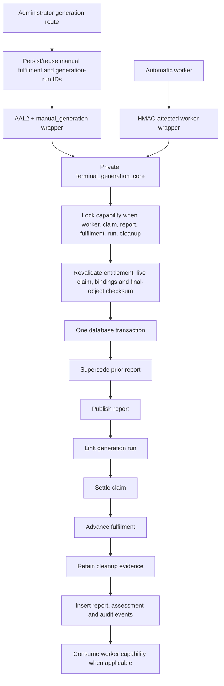

# Sixth adversarial remediation evidence

Status: sixth-handoff corrections implemented and locally verified. PR #21 remains draft, open and unmerged.
Production and UAT were not modified. No policy or route was enabled outside
rolled-back/disposable local tests; no secret, identity, email, AI call,
provider call or real webhook was created or invoked.

## Closure matrix

| Finding | Closure | Behavioural evidence |
|---|---|---|
| H1 shared-row declassification | Immutable `phase14_operation_ref`, deterministic historical backfill, OLD+NEW ownership classification and function-owner transition boundary | protected/unprotected conversion, field change, nullification, unknown/legacy names, upsert, bulk update/delete, actual `service_role` |
| H2 capability ID as credential | Per-step HMAC attestation with a Vault-backed DB verification key and a distinct application secret | UUID-only denial, forged signature, wrong worker, payload binding, nonce replay |
| H3 long-lived arbitrary capability | Locked `expected_step`, per-transition lease generations and an independently HMAC-attested expired-step-lease recovery action | skip, repeat, out-of-order, stale generation, early recovery, overall expiry, stale epoch, same-process restart, competing replacement workers, former-worker rejection and consumed replay |
| H4 split generation terminal | One private `phase14_private.terminal_generation_core` owns every terminal database effect; the HMAC worker and AAL2/manual-policy wrappers both delegate to it | manual rollback after each of 18 wrapper/core boundaries; worker rollback after each of 20 boundaries; successful exact-business-identity retry for each entry point |
| H5 workflow-start ambiguity | Durable outbox and explicit acceptance-uncertain boundary | competing dispatcher, lost response, no false `failed_before_provider`, durable run identity requirement |
| H6 cleanup absence | Provider-specific result classifier and separate deletion/acceptance/absence/error evidence | every non-not-found class rejected as absence; post-delete verification required |
| M1 bounce evidence | Immutable, expiring, single-use customer contact verification | forged, expired, cross-customer, concurrent consumption, consumed replay, atomic recipient CAS and permanent complaint denial |
| M2 gate approval reuse | Monotonic authority epoch bound to policies, routes, capabilities and attestations | suspend plus same-version re-satisfaction invalidates all prior authority |
| M3 provider evidence lifetime | Maximum age/future/dispatch/state/epoch bindings and atomic consumption | stale, future, state-changed and exact-once valid attestation |
| M4 unsafe unpublished history | Archived historical bytes, one atomic canonical migration, and separate restartable UAT and production-history reconciliation artefacts | fresh replay, former post-commit boundary, exact production baseline reproduction, sentinel preservation, missing-ledger acknowledgement recovery, UAT/production-history convergence and safe restart |

## Exact production-history convergence

Read-only evidence is recorded in `production-history-read-only-evidence-2026-07-15.md`. Production has the early disabled fulfilment, provenance, linkage, flag, PDF-delivery and email-state foundation under six timestamped Phase 14 migration records. It does not have the security closure or fourth, fifth, sixth and handoff-correction controls. All observed automation flags are disabled.

The controller-only production strategy is generated as `scripts/phase14-production-canonical-reconciliation.sql`; it is distinct from the UAT-only strategy and was not executed remotely. A disposable local reconstruction proved:

- exact production ledger versions and names;
- exact production-boundary inventory digest `417dfbf2fb7fdea1727d7dc9d84d0463a597db6b545def32de18d2e15d8509cd`;
- stable sentinel data checksum `258c8fa9d59383cc27857efb093c219f0db02c130ad6dc8ac62eb25d9f5275e4` before convergence, after convergence, after missing-ledger recovery and after safe restart;
- replacement of only the six timestamped Phase 14 ledger records with canonical `0017` acknowledgement;
- final schema equality with fresh canonical and simulated-UAT replays at `5488895a97156f89e406491e782a65cd226e49fbe6293d4d964a31af2ead231a`;
- zero satisfied gates, enabled feature policies or enabled AI routes.

## Manual-versus-worker terminal transaction map



The legacy manual publication, generation-run linkage and post-publication event RPCs remain defined only for historical compatibility and have execute revoked from all runtime roles. The application no longer calls them.

## Expired-step-lease takeover state diagram

```mermaid
stateDiagram-v2
  [*] --> Leased: capability leased at step S / generation G / execution E-old
  Leased --> RejectedEarly: step lease has not expired
  Leased --> RejectedTerminal: capability expired, revoked, gate/policy stale, or authority epoch changed
  Leased --> RecoveryRace: step lease expired; signed recovery envelope is current
  RecoveryRace --> RejectedLoser: locked row no longer matches E-old / G
  RecoveryRace --> Recovered: exactly one transaction wins
  Recovered --> LeasedNew: preserve step S; execution E-new; generation G+1; fresh lease; takeover_count+1; audit
  LeasedNew --> RejectedFormer: any E-old or generation G attestation
  LeasedNew --> Continue: next valid attestation resumes exactly at step S
```

The recovery envelope binds capability/type, operation key, old and proposed execution IDs, persisted step and lease generation, all commercial IDs and recipient, authority epoch, reason, issue/expiry times and nonce. Using the same execution ID supports controlled process restart; a different ID supports replacement-worker takeover.

## Shared-table ownership

The five shared tables carry `phase14_operation_ref`. Existing Phase 14 rows are
backfilled using reviewed deterministic relationships and legacy identities.
The mutation trigger classifies both row images; ownership cannot be erased,
added, reassigned or bypassed with an unrecognised event name. Direct service
DML is allowed only for non-Phase-14 rows. Approved transitions must execute as
the reviewed database function owner with a matching internal transition
context, so a caller-set GUC alone never grants authority.

## Worker attestation threat model

The service-role credential authenticates a database client but does not prove
which worker or step is acting. Each worker call therefore signs a canonical
HMAC envelope binding capability/type, operation and execution identities,
action/step, all commercial IDs and recipient, lease generation, request hash,
issued/expiry times, nonce and authority epoch. The database key is referenced
through private Vault metadata; runtime roles cannot read the schema, key row or
decrypted value. Nonces are transactionally consumed. The application key is
read only while signing and is excluded from workflow values, database rows,
responses, logs and errors.

Rotation is dual-key: an AAL2 operator provisions a new `current` key, the old
key becomes `previous` for a bounded overlap, workers switch key IDs, and the
old key expires. The migration provisions no key and the rotation RPC remains
an enablement-only action.

## Capability step state

```text
authorised/claim
  -> leased/workflow_start_claim (automatic generation)
  -> workflow_start_dispatch -> workflow_start_settle
  -> generation_claim -> fulfilment_assembling -> narrative_decision
  -> AI checkpoint/attempt or lease renewal -> generation_run_record
  -> rendering -> temp cleanup registration -> storing -> draft commit
  -> temp link -> final cleanup registration -> temp cleanup settlement
  -> terminal_publication -> consumed
```

Delivery, reconciliation and cleanup capabilities use separate, similarly
closed branches. Every arrow verifies the exact signed step while holding the
capability lock, then increments the lease generation.

## Terminal generation transaction

The common private core locks and validates the worker capability when present,
live committed claim, draft report, fulfilment, generation run and pre-existing
final-object cleanup row; revalidates the entitlement and immutable storage
checksum/path; supersedes the prior report; publishes the new report; links the
generation run; settles (but does not delete) the claim; advances fulfilment;
marks the orphan-cleanup row `retained`; inserts report, assessment and audit
events; and consumes the capability for the worker entry. Any failure rolls the
entire set back. A copied final object remains represented by the durable
cleanup row until this commits.

The manual route now creates or reuses a durable manual fulfilment before the
claim and always persists generation provenance. It rejects an already
delivery-ready fulfilment as terminal rather than treating it as a resumable
attempt. The worker and manual fault suites restore the identical claim,
report, fulfilment, run and cleanup identities after each injected rollback,
then commit successfully with those same business identities.

## Workflow-start uncertainty

The outbox uses `pending`, `leased`, `acceptance_uncertain`, `started`,
`failed_before_provider`, `reconciliation_required` and `cancelled`. The row is
made acceptance-uncertain immediately before the external call. Workflow SDK
4.6.0 exposes neither an idempotency key nor a run lookup for `start`, so a lost
response is never automatically retried and remains reconciliation-required.
Startup returns success only after the returned run ID is durably recorded.

## Storage classification

| Result | Verified absence? | Handling |
|---|---:|---|
| documented HTTP 404 plus known missing code/message | yes | settle deleted/absence verified |
| authentication or authorization failure | no | error/retry or dead letter |
| rate limit or timeout | no | retry |
| DNS/network failure or provider outage | no | retry |
| malformed response or checksum-read failure | no | error/alert |
| unknown provider error | no | error/alert |

Deletion requested, delete API accepted, absence verified and verification
error are stored independently. The database rejects a verified-deletion claim
without the exact `object_not_found` classification.

## Contact verification and authority epoch

Contact verification binds order, assessment, customer identity, old/new email,
a strict method, external evidence reference, trusted verifier/time, expiry and
single-use state. Bounce remediation locks and consumes it in the same
transaction as commercial recipient CAS and immutable authorization evidence.

Every gate satisfaction, suspension, downgrade, re-satisfaction or required
version change increments `authority_epoch`. The same transaction disables
feature and AI-route approvals, revokes active capabilities and produces audit
evidence. Re-satisfying the same numeric version therefore grants no authority
until every approval is freshly issued for the new epoch.

## Canonical migration and UAT strategy

Historical UAT SQL and SHA-256 identities are preserved under
`migration-audit-archive`. The deployable directory contains one Phase 14
version, `0017_phase14_canonical_disabled_foundation.sql`, with one outer
transaction and all controls disabled. Supabase CLI 2.109.1 is pinned because
2.81.3 cannot prepare the combined canonical transaction.

The controller-only UAT script verifies the exact old ledger and schema
boundary, holds an advisory lock, applies the archived fifth and sixth deltas
and reconciles the ledger in one transaction. It preserves application data and
is a verified no-op after commit. Local fresh and simulated-UAT paths have the
same full schema inventory SHA-256 recorded in the archive README. The CI also
executes the former closure post-commit/missing-ledger boundary and canonical
commit/missing-ledger acknowledgement recovery.

The production-specific generator verifies nine reviewed source identities and
emits a separate artefact with the exact production ledger preflight. CI builds
the early production schema from archived `0017`–`0019`, reproduces the exact
observed ACL, constraint and bucket variants, verifies the production inventory
digest, preserves synthetic rows, applies only the missing controls, exercises
missing-ledger recovery and safe restart, and compares the full final schema
inventory with the fresh canonical bytes.

## Evidence classification

- Behavioural SQL: the sixth suite covers both terminal wrappers, all 18 manual
  and 20 worker fault boundaries, rollback, exact-business-identity retry and
  legacy execute revocation; the existing integration/AAL2/fourth/fifth/
  atomic/runtime-mutation suites remain in the replay.
- Multi-session behavioural SQL: generation claim/concurrency, contact evidence
  consumption and signed expired-step-lease recovery races. Recovery coverage
  includes early takeover, two contenders/one winner, former worker, stale
  generation, exact-step resume, no repeated transition, overall expiry,
  authority epoch and same-execution process restart.
- Unit/runtime doubles: storage and email-provider fault injection, workflow
  serialization, AI accounting and source-contract regression.
- Inventory/static: source-string tests, table/function grants and schema hash.
- Local migration: empty replay, former-boundary recovery, UAT simulation,
  exact production-history simulation, data preservation, missing-ledger
  recovery, safe restart and canonical convergence. These are not deployed-UAT
  or deployed-production evidence.
- Exact-head CI: the GitHub checks attached to the final pushed PR head are the
  authoritative record; no pass is claimed before those checks complete.

Another fresh independent review remains required. Do not mark the PR ready or
merge it based on this implementation round.
